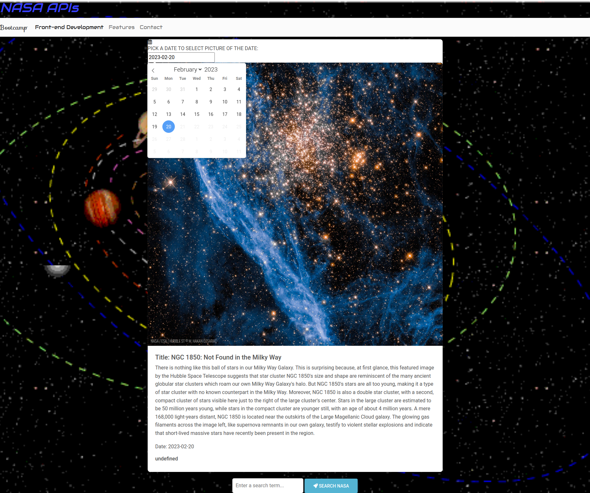
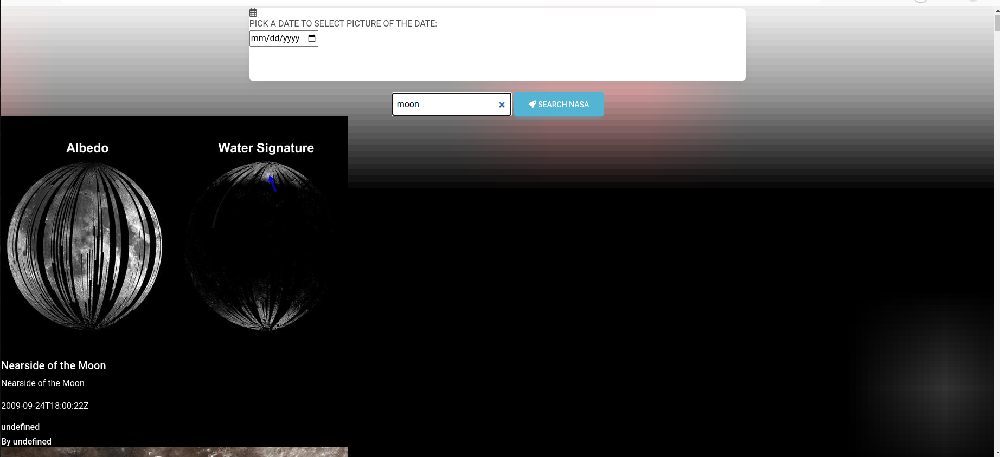

# NASA APIs (Astronomy Picture of the Day and Search engine of NASA)

## The first part is Astronomy Picture of the Day
The myscript.js file is a JavaScript script that uses the NASA APOD (Astronomy Picture of the Day) API to retrieve and display the image or video for a selected date. The code uses the flatpickr library to create a date picker and listens for changes to the selected date. When a new date is selected, an XMLHttpRequest is sent to the NASA APOD API with the selected date, and the response data is parsed and used to update the HTML to display the corresponding image or video.

The code first selects the date picker element with the ID "pickadate" using document.querySelector(). It then creates a new XMLHttpRequest object with new XMLHttpRequest() and sets up the flatpickr date picker with a max date of today and a date format of "Y-m-d".

The code then adds an event listener to the date picker element that listens for a "change" event and triggers a function when the event occurs. The function retrieves the selected date from the date picker using pickaDate.value, appends it to the NASA APOD API endpoint URL along with the API key, and creates a new URL for the API request. It then sends an XMLHttpRequest with the new URL to retrieve the APOD data.

When the XMLHttpRequest object receives a response, the code checks that the response has a ready state of 4 (meaning the operation is complete) and a status of 200 (meaning the request was successful). If the response is successful, the response data is parsed using JSON.parse() and various data elements are extracted from the response, such as the image or video URL, title, explanation, and date. The HTML is then updated using the extracted data to display the corresponding media element and information about the media.

If the media type is an image, an HTML img tag is created with a source URL of the retrieved image and a link to the high-definition version of the image. If the media type is a video, an HTML iframe tag is created with a source URL of the retrieved video.

## The second part is Search engine of NASA

The search.js file is a JavaScript code that allows users to search for images related to a query using the NASA Images API.

The code starts by selecting the necessary HTML elements using their IDs, such as the search form, search input field, and search results container. It then adds an event listener to the search form that triggers a function when the form is submitted.

Inside the event listener function, the code first prevents the default form submission behavior using event.preventDefault(). It then retrieves the user's search query from the search input field.

Next, the code checks if the search results for the query are already stored in local storage. If the results are found in local storage, they are immediately displayed to the user by setting the innerHTML of the search results container to the stored results.

If the search results are not found in local storage, the code makes a request to the NASA API to search for images related to the query using the fetch() function. The API response is then converted to HTML elements representing search results using the map() function. If no search results are found, a modal is displayed to the user using Bootstrap's modal component.

If search results are found, they are displayed to the user by setting the innerHTML of the search results container to the HTML elements representing the search results. The code also stores the search query and results in local storage using the setItem() method.

If an error occurs while searching, an error message is displayed to the user in the search results container.

